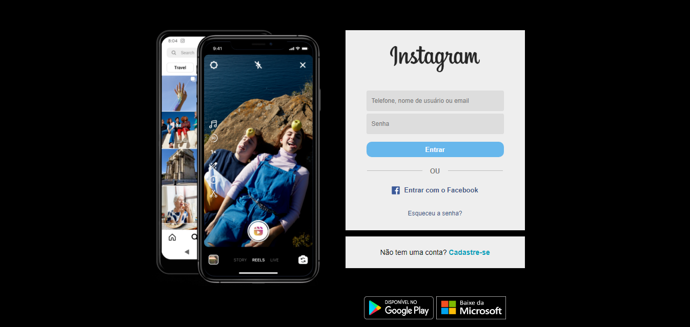

O projeto é uma pagina clone do login do instragram, usa apenas html e css, fiz uma pagina extra para caso o usuário aperte em "cadastra-se" mas como o projetonão está hospedado, ele não encontra a pagina, o diferencial dessa projeto é que ele se adaptar a tela do usuáio, funcionando em smartphones tambem.
Voce pode baixar a pasta pai e rodar o arquivo "index extend.html" e "nova pag.html" para vizualizar.

Veja as imagens do projeto:

Versão mobile:

Pagina extra:

Versão mobile:

