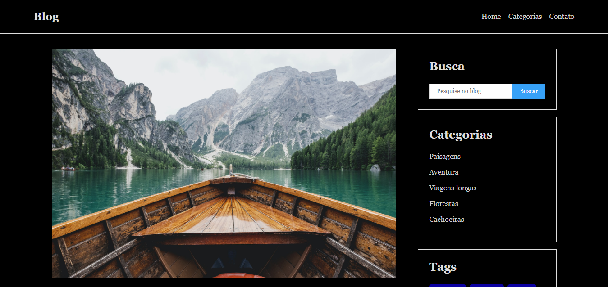
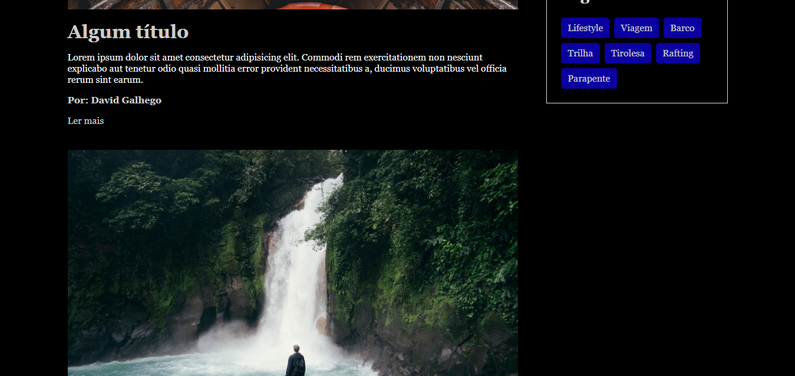
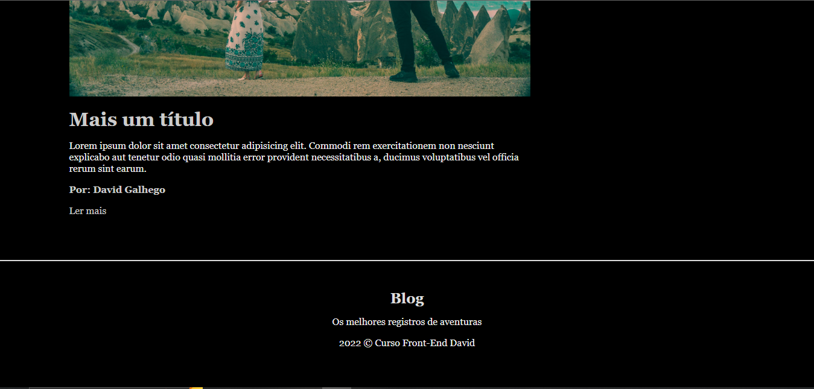

Este projeto simula um blog de viagens, fazendo uso de imagens e focando numa organização de html semântico, além disso possui adaptabilidade, ele possui paginas filhas para caso aperte em algum link, mas como não está hospedado, talvez não funcione
para telas de smatphone.

Veja algumas imagens do projeto:

