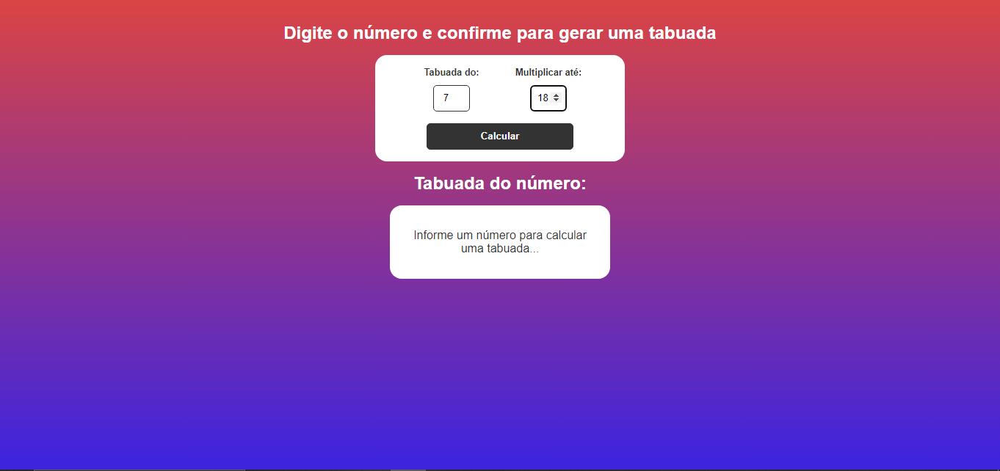
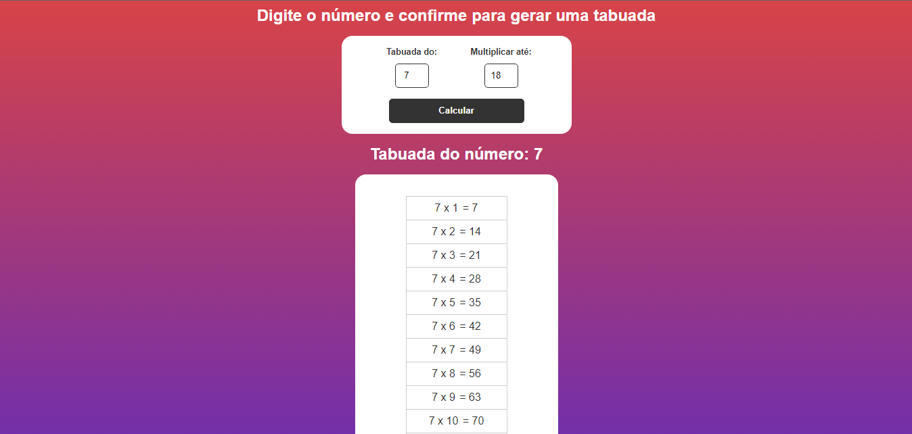

O seguinte projeto é uma simples calculadora de tabuada, feita para treinar minhas habilades com javascript. Para rodar o codigo, baixe a pasta pai
e rode "index.html" no seu navegador 

Algumas Imagens do Projeto:

